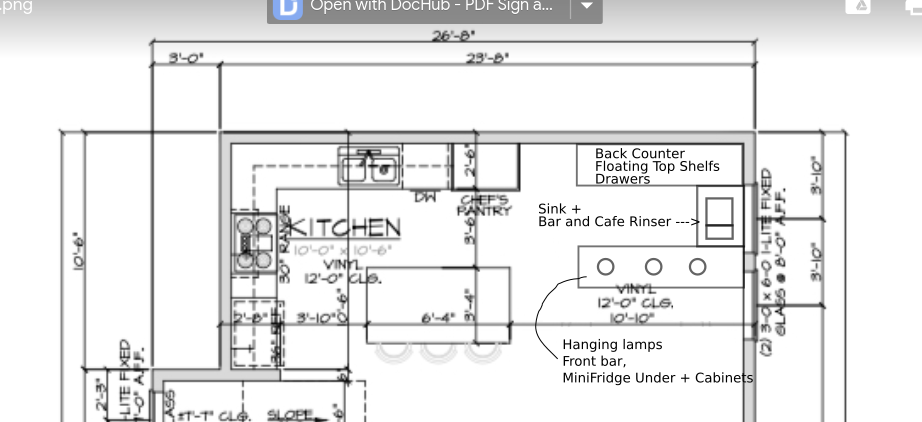

# Plans

## Kitchen

### Appliance Replacements
- [range](https://www.appliancesconnection.com/lg-lsgl6337f.html)
- [sink basin](https://www.homedepot.com/p/Ruvati-Farmhouse-Apron-Front-Stainless-Steel-33-in-Single-Bowl-Kitchen-Sink-in-Gunmetal-Black-Matte-RVH9733BL/311467462)

### Island
- Kitchen Island change for a waterfall design
- [fridge](https://www.homedepot.com/p/Cafe-5-7-cu-ft-Built-in-Undercounter-Dual-Drawer-Refrigerator-in-Stainless-Steel-CDE06RP2NS1/308460749#overlay)

### Bar
- Where the dining room is gets replaced by a bar with same wood + stone as kitchen

- [sink](https://www.build.com/product/summary/1635796?uid=3878955)
- [bar and cafe rinser 7" x 15"](https://www.espressoparts.com/products/7-x-15-x-7-8-rinser-with-side-spray)

## Balcony 
- Add gas hookup

## Bedroom
- Swap out carpet with vinyl flooring

## Throughout 
- Vinyl Dakota Oak
- Wiring for security cameras entryway + every room
- Cat6 Ethernet wiring to every room 
- Leads to [cat6 patch](amazon.com/Leviton-476TM-624-Twist-Mount-Patch/dp/B003O84ZWY/ref=asc_df_B003O84ZWY/?tag=hyprod-20&linkCode=df0&hvadid=193989831776&hvpos=&hvnetw=g&hvrand=7528561762018511060&hvpone=&hvptwo=&hvqmt=&hvdev=c&hvdvcmdl=&hvlocint=&hvlocphy=9027577&hvtargid=pla-315839190901&th=1)
- Light sockets compatible with Philips Hue, [E26, E12, GU10](https://www.philips-hue.com/en-us/products/smart-light-bulbs), [recessed lights](https://www.philips-hue.com/en-us/products/smart-recessed-lights),
  [under glow cabinet](https://www.philips-hue.com/en-us/products/smart-light-strips)
